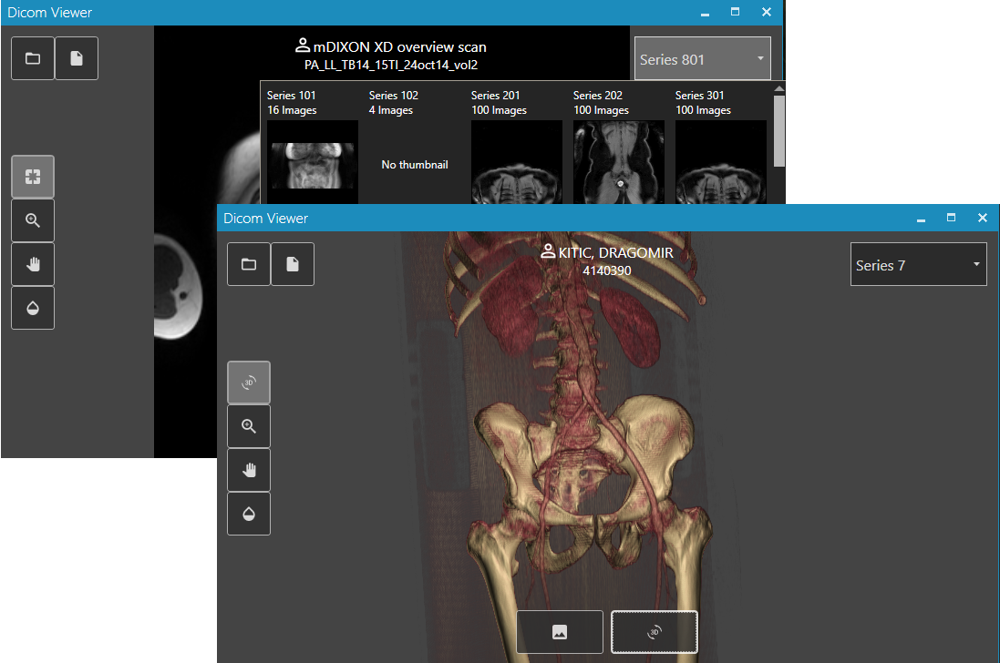

# Dicom Viewer

* Features
  * Flat style minimalistic user interface
  * 2D image viewing
  * 3D shaded volume rendering
  * Scroll/Rotate/Zoom/Pan/Windowing mouse interaction
  * Series pictorial index
  * Load from DicomDir
  * Load from a folder
  * Load single Dicom files

* Supported DICOM classes
  * CTImageStorageSopClass - 1.2.840.10008.5.1.4.1.1.2
  * MRImageStorageSopClass - 1.2.840.10008.5.1.4.1.1.4
  * EnhancedMRImageStorageSopClass - 1.2.840.10008.5.1.4.1.1.4.1
  * XA3DImageStorageSopClass - 1.2.840.10008.5.1.4.1.1.13.1.1
  * XRayAngiographicImageStorageSopClass - 1.2.840.10008.5.1.4.1.1.12.1

* Supported compression codecs:
  * JPEG Baseline (Process 1): Default Transfer Syntax for Lossy JPEG 8 Bit Image Compression
  * JPEG Extended (Process 2 & 4): Default Transfer Syntax for Lossy JPEG 12 Bit Image Compression (Process 4 only)
  * JPEG Lossless, Non-Hierarchical (Process 14)
  * JPEG Lossless, Non-Hierarchical, First-Order Prediction (Process 14 [Selection Value 1]): Default Transfer Syntax for Lossless JPEG Image Compression
  * JPEG 2000 Image Compression (Lossless Only)
  * JPEG 2000 Image Compression
  * JPEG-LS Lossless Image Compression
  * JPEG-LS Lossy (Near-Lossless) Image Compression
  * RLE Lossless

* Build
  * Build using Visual Studio 2017 or newer.
  * Uses VTK for visualization.
  * Install VTK toolkit and set VTK_PATH environment variable to installed location (e.g. VTK_PATH=C:\Program Files\VTK).
  * Other dependencies are automatically installed from nuget.org upon first build.
